# EYE BEE M Pets - Capstone Project

### Frontend

```bash
cd frontend
npm install
npm run dev
```

### Backend (Coming soon)

```bash
cd backend
mvn spring-boot:run
```

## Lighthouse performance tests

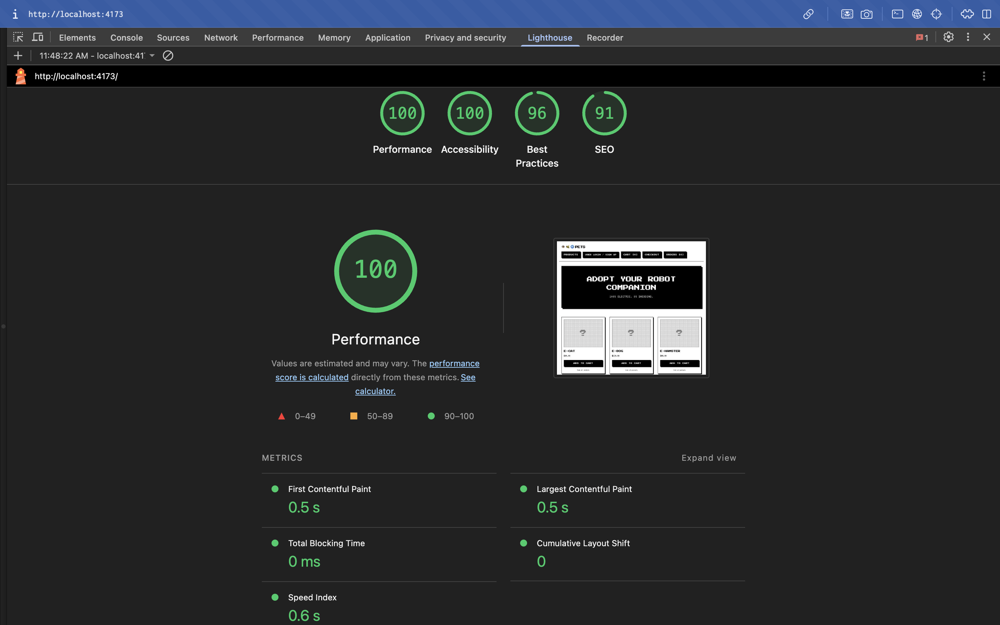

## TNG + Selenium Tests (Frontend)


## TNG + Selenium Tests pt 2

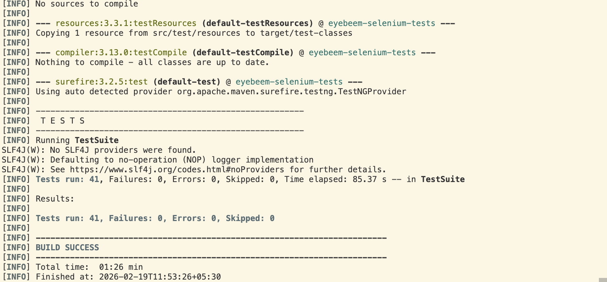

## TNG + Selenium pt 3

## Allure Reports - Module Wise

### Module 1 - Registration
1. Registration Module
Login UI – Form display, submit behavior, navigation
Auth API – Login, signup/account creation, user endpoints
Database – User-related tables and data


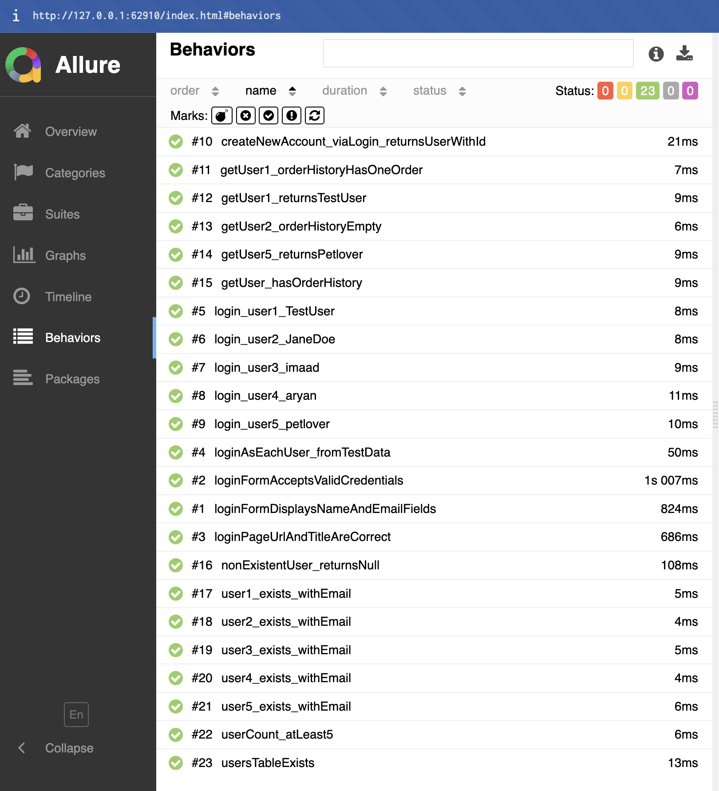

### Module 2 - Catalog
2. Catalog Module
Home page – Title, hero, navbar, footer, product grid, logo link
Products page – Display, search, filters, add-to-cart
Product images – Image loading on home and products pages
Layout & navigation – Header, footer, Products link
Products API – Product endpoints
Database – Inventory tables and data


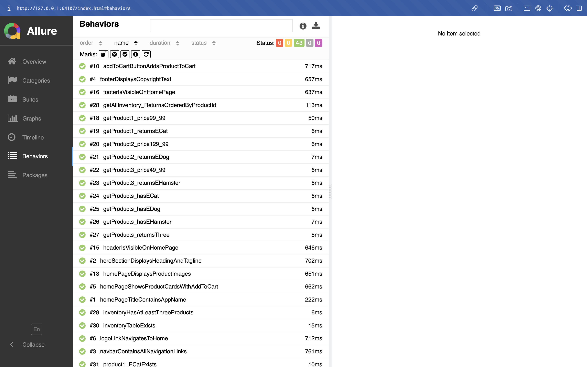
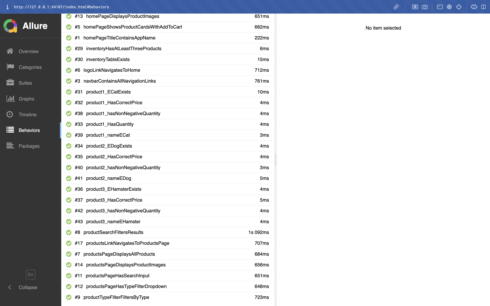

### Module 3 - Cart
3. Cart Module
Cart UI – Empty cart, items list, totals, checkout button, clear, Shop Products link
Navigation – Cart link
Cart API – Cart endpoints

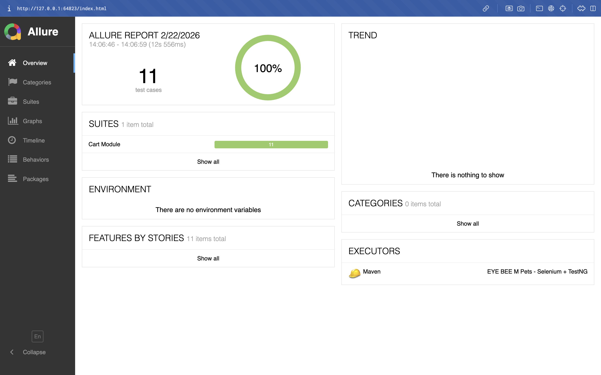
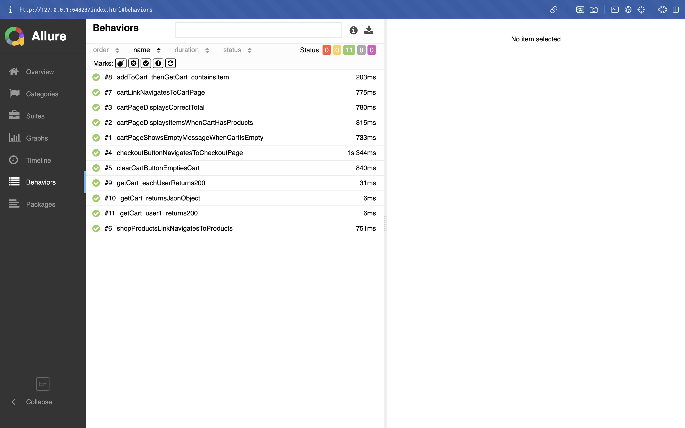

### Module 4 - Checkout
4. Checkout Module
Checkout UI – Address, payment, order submission, empty cart handling, Back to Cart

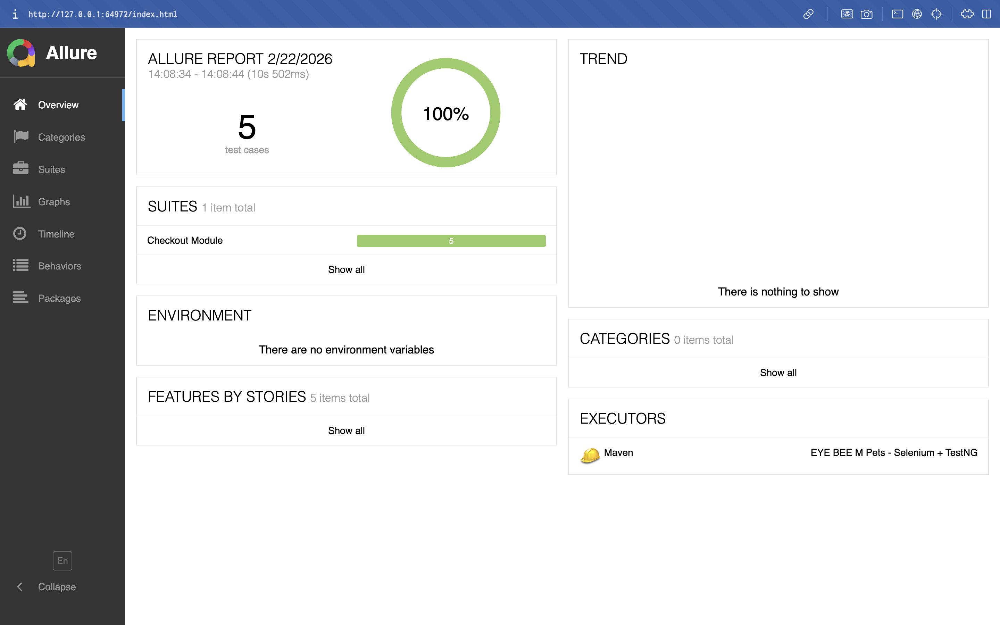
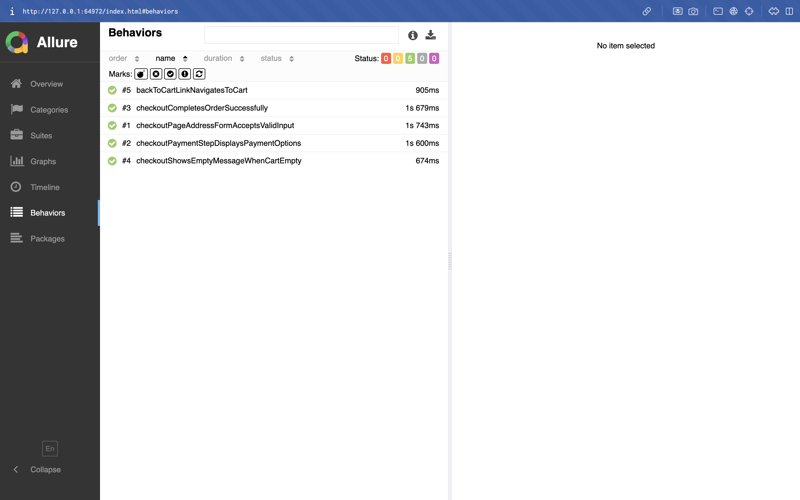

### Module 5 - History
5. History Module
Orders UI – Empty orders, list, details, Shop Products link
Orders API – Order endpoints
Database – Orders and order items tables and data

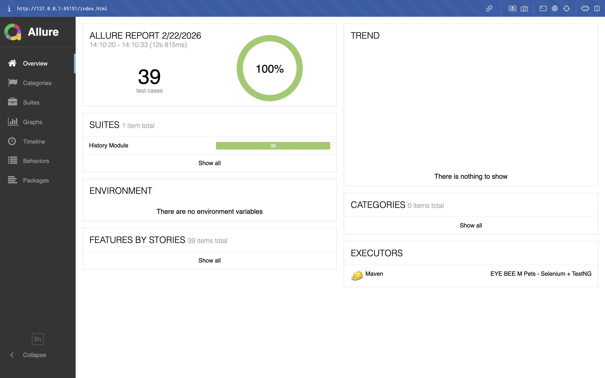
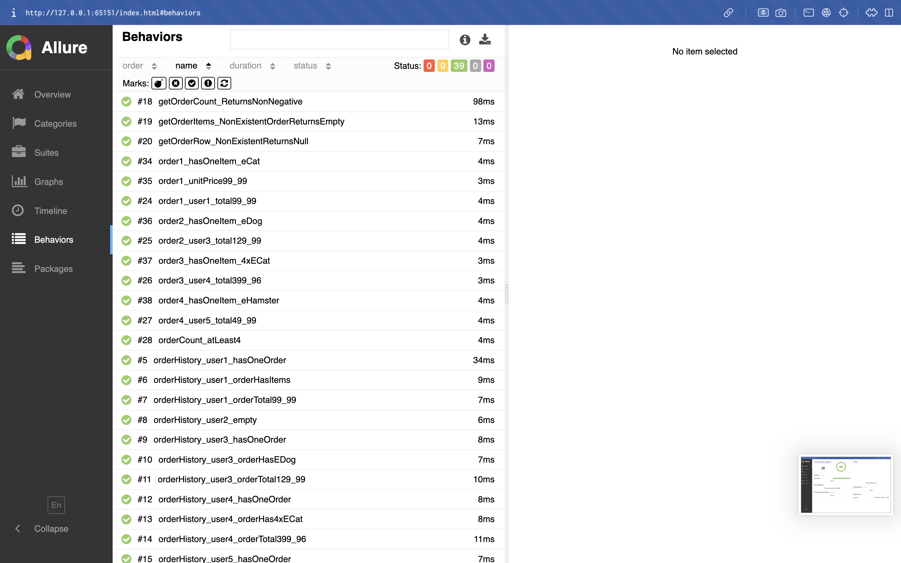
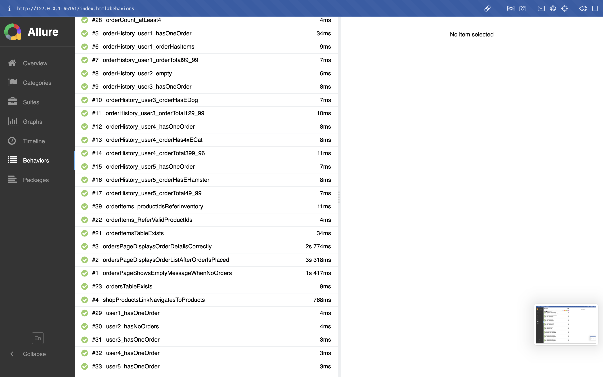
