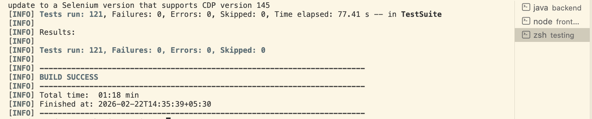

# EYE BEE M Pets - Capstone Project

### Frontend

```bash
cd frontend
npm install
npm run dev
```

### Backend (Coming soon)

```bash
cd backend
mvn spring-boot:run
```

## Lighthouse performance tests


## TNG + Selenium Tests (Frontend)


## TNG + Selenium Tests pt 2


## TNG + Selenium Tests pt 3




## Allure Reports - Module Wise (tng+sel_3_allure_modules)

### Module 1 - Registration


### Module 2 - Catalog


### Module 3 - Cart


### Module 4 - Checkout


### Module 5 - History


